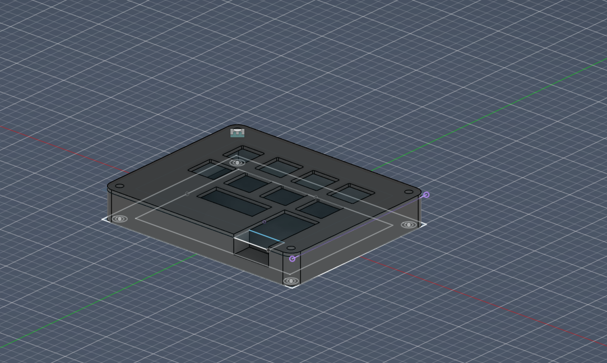
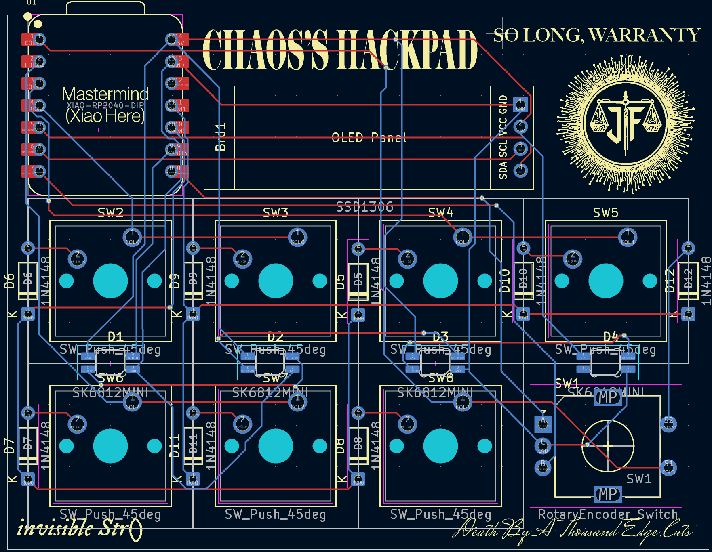
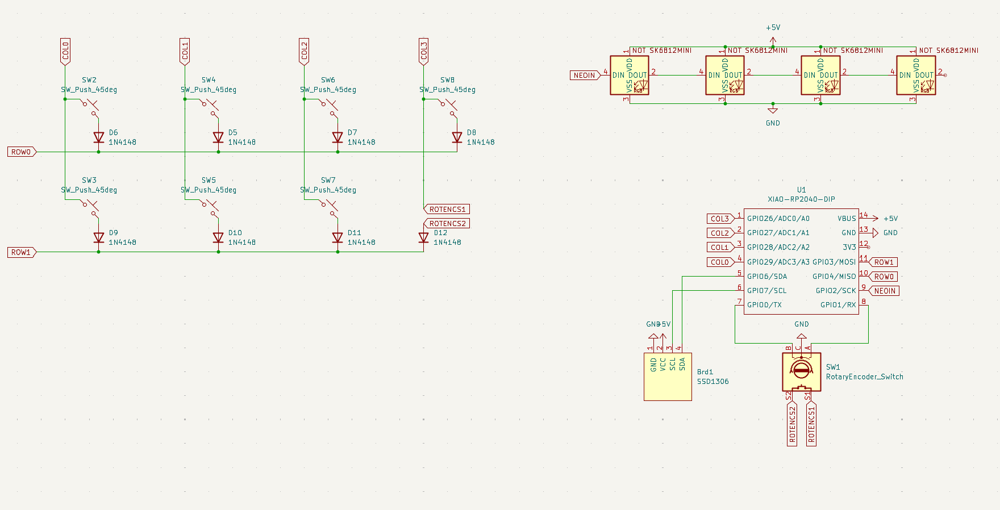

# Chaos's Hackpad

## Features
- 128x32 OLED display
- EC11 rotary encoder
- 4 SK6812 RGB LEDs
- 7 MX-Style keys

## CAD Model:
Screws together using 4 M3 screws.   
Comes in two pieces - the base and the top.  

  

## PCB

### Schematic

## BOM
- 7x Cherry MX Switches
- 7x DSA Keycaps
- 4x M3x16 screws
- 1x EC11 Rotary Encoder
- 1x 0.96” 128x32 OLED display
- 4x SK6812 Mini-E LEDs
- 1x XIAO RP2040
- 1x case