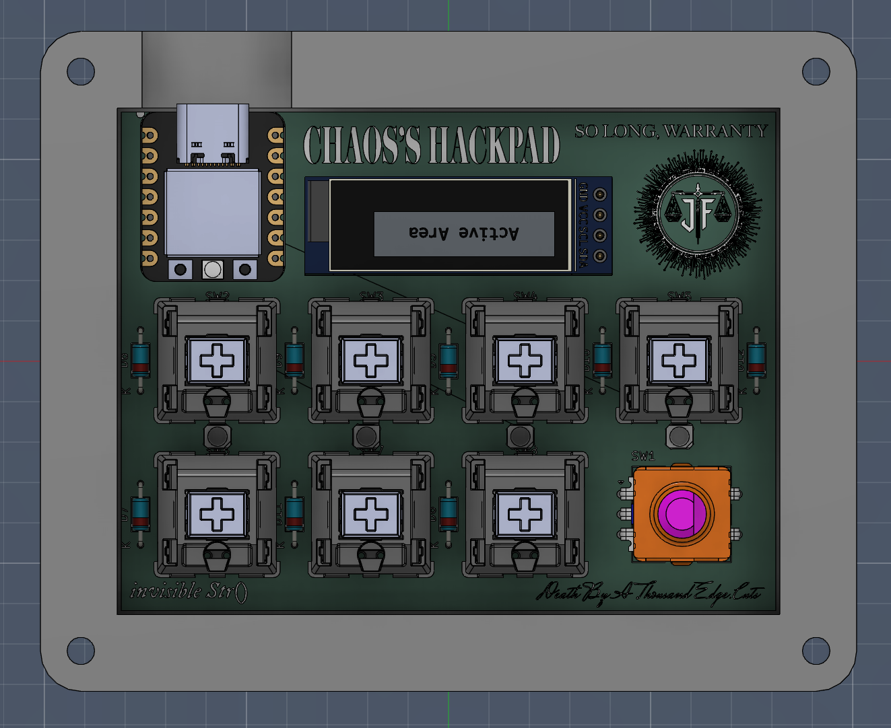
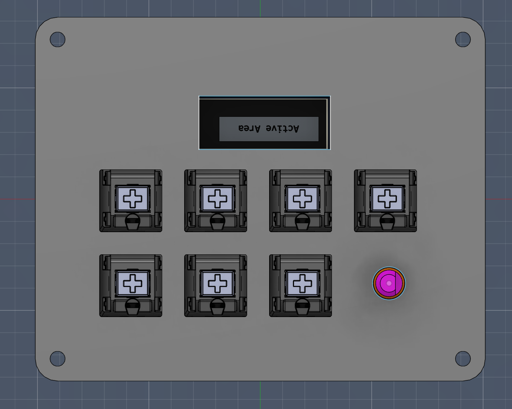
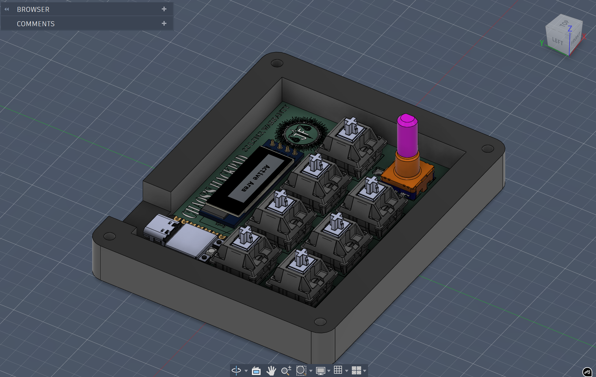
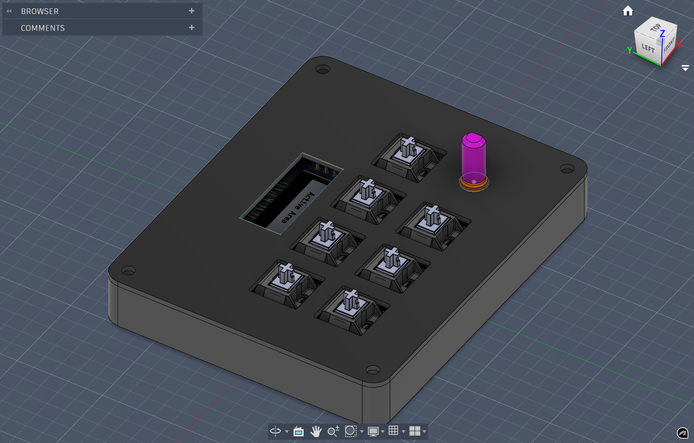
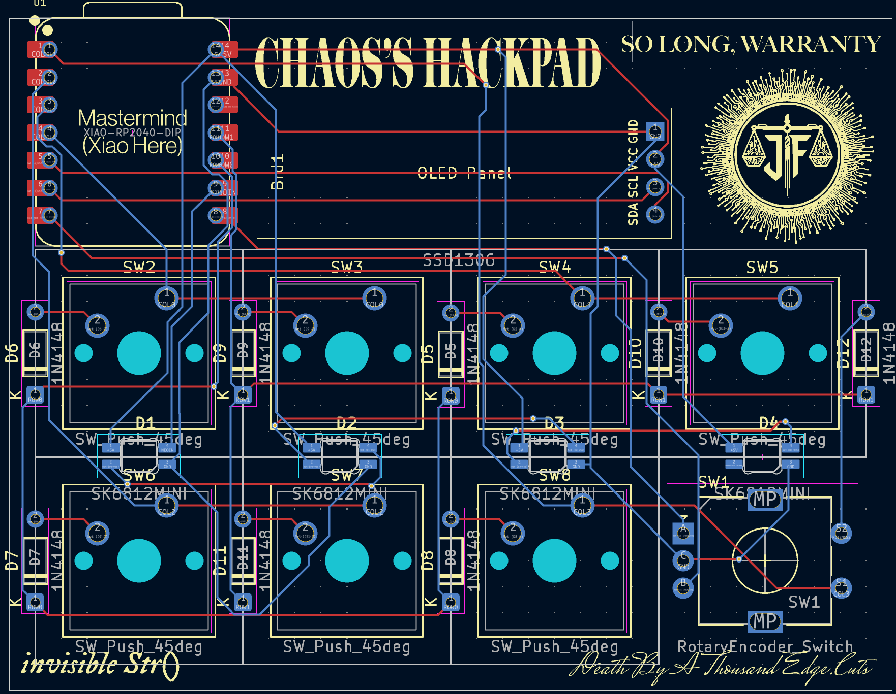
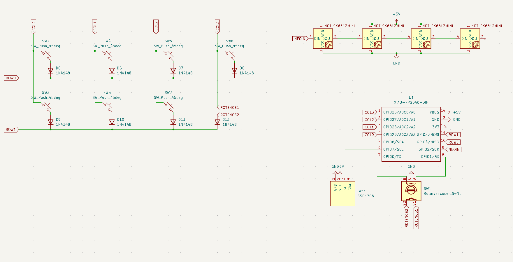

# Chaos's Hackpad

### Features
- 128x32 OLED display
- EC11 rotary encoder
- 4 SK6812 RGB LEDs (backlighting)
- 7 MX-Style keys
- WASD and volume controls (firmware will be updated in the future)

### CAD Model:
Screws together using 4 M3 screws.   
Comes in two pieces - the base and the top.  

**Top View**
| Case Open | Case Closed |
|:---------:|:-----------:|
|  |  |

**Side View**
| Case Open | Case Closed |
|:---------:|:-----------:|
|  |  |

### PCB

### Schematic

## Firmware

Runs **CircuitPython** with **KMK firmware** on the **Seeed Studio XIAO RP2040**
The included [firmware](firmware/main.py) file is a temporary firmware used for testing the hardware, and will be changed when I build the board.
It provides basic key input, rotary encoder volume control, RGB lighting, and OLED display output.

To install **CircuitPython**, follow (this guide from Seeed Studio)[https://wiki.seeedstudio.com/XIAO-RP2040-with-CircuitPython/].
To install **KMK**, follow (this guide)[https://github.com/KMKfw/kmk_firmware/blob/main/docs/en/Getting_Started.md].

## BOM
- [bom.csv](bom.csv)
- [Interactive PCB BOM](https://htmlpreview.github.io/?https://github.com/Chaos142/ChaosHackpad/blob/main/ibom.html)
- 7x MX-Compatible Uniform Profile Keycaps
- 4x M3x16 Screws
- 1x 3D Printed Case

## [Resources Folder](Resources)
- CustomSwitches.pretty: Cherry MX Switch Footprint with 3D Model
- KiCad-SSD1306-0.91-OLED-4pin-128x32.pretty: [128x32 SSD1306 Footprint](https://github.com/gorbachev/KiCad-SSD1306-0.91-OLED-4pin-128x32.pretty)
- [Seeed Studio XIAO Series Library](https://github.com/Seeed-Studio/OPL_Kicad_Library/tree/master/Seeed%20Studio%20XIAO%20Series%20Library)
- [Fonts Folder](Resources/Fonts): Fonts used for the PCB Silkscreen
- [Models Folder](Resources/Models): 3D models for the KiCad footprints
- SK6812MINI-E: Symbol and footprint libraries for the NeoPixels